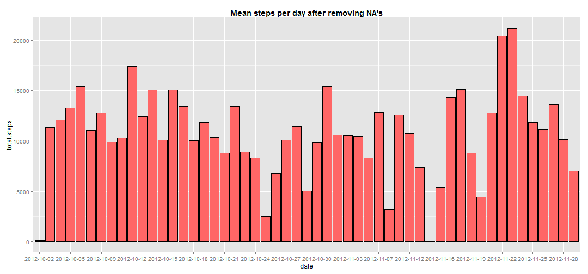
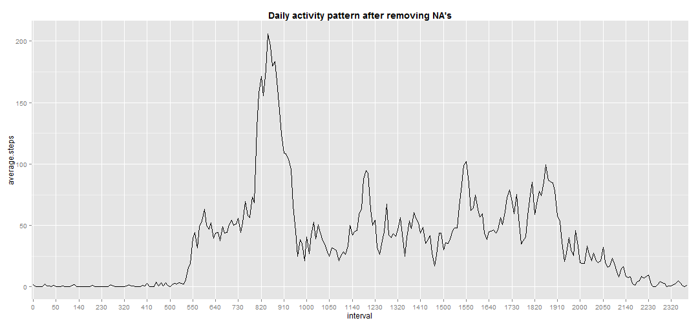
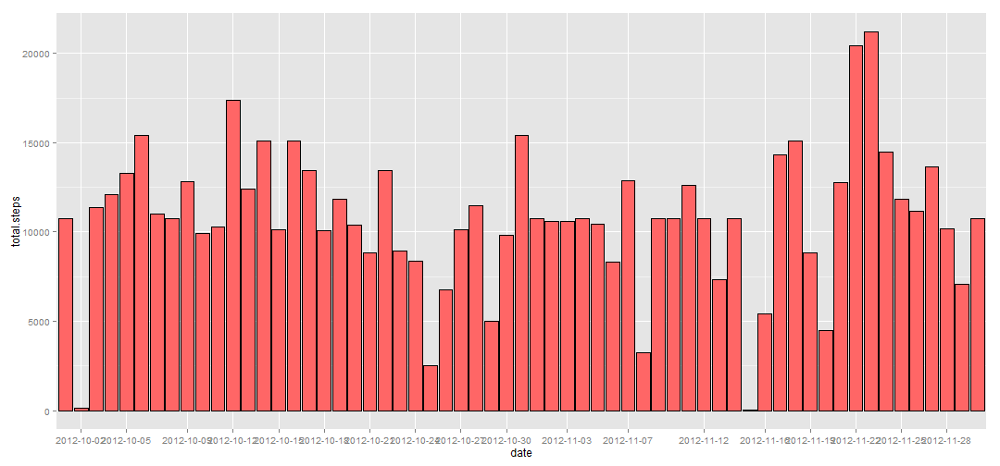
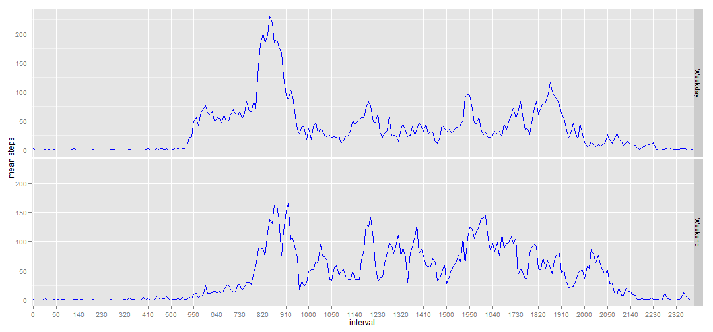

## Loading and Preprocessing

Unzip the activity.zip file and load it into R. Remove rows having NA's


```r
setwd("D:/R projects//Learning/activity monitoring/")
mydata <- read.csv("activity.csv")
dat <- mydata[complete.cases(mydata),]
```

## Mean total number of steps taken per day


```r
library(knitr)
library(reshape2)
library(ggplot2)
library(dplyr)
```

```
## 
## Attaching package: 'dplyr'
## 
## The following objects are masked from 'package:stats':
## 
##     filter, lag
## 
## The following objects are masked from 'package:base':
## 
##     intersect, setdiff, setequal, union
```

```r
library(rCharts)

dt <- tbl_df(dat)
res <- dt %>% 
        group_by(date) %>%
        summarise(total.steps = sum(steps), mean = mean(steps), median = median(steps))

plot1<- ggplot(res, aes(x= res$date, y = total.steps)) + geom_histogram(fill = "#FF6666", color = "black", stat = "identity") + xlab("date") + scale_x_discrete(breaks = res$date[seq(1, length(res$date), by = 3)]) +  labs(title = "Mean steps per day after removing NA's") + theme(plot.title = element_text(lineheight = 0.8, face = "bold"))
```

```r
plot1
```

 

Here is the table of containing mean and median of steps taken per day

```r
knitr::kable(res)
```


|date       | total.steps|    mean| median|
|:----------|-----------:|-------:|------:|
|2012-10-02 |         126|  0.4375|      0|
|2012-10-03 |       11352| 39.4167|      0|
|2012-10-04 |       12116| 42.0694|      0|
|2012-10-05 |       13294| 46.1597|      0|
|2012-10-06 |       15420| 53.5417|      0|
|2012-10-07 |       11015| 38.2465|      0|
|2012-10-09 |       12811| 44.4826|      0|
|2012-10-10 |        9900| 34.3750|      0|
|2012-10-11 |       10304| 35.7778|      0|
|2012-10-12 |       17382| 60.3542|      0|
|2012-10-13 |       12426| 43.1458|      0|
|2012-10-14 |       15098| 52.4236|      0|
|2012-10-15 |       10139| 35.2049|      0|
|2012-10-16 |       15084| 52.3750|      0|
|2012-10-17 |       13452| 46.7083|      0|
|2012-10-18 |       10056| 34.9167|      0|
|2012-10-19 |       11829| 41.0729|      0|
|2012-10-20 |       10395| 36.0938|      0|
|2012-10-21 |        8821| 30.6285|      0|
|2012-10-22 |       13460| 46.7361|      0|
|2012-10-23 |        8918| 30.9653|      0|
|2012-10-24 |        8355| 29.0104|      0|
|2012-10-25 |        2492|  8.6528|      0|
|2012-10-26 |        6778| 23.5347|      0|
|2012-10-27 |       10119| 35.1354|      0|
|2012-10-28 |       11458| 39.7847|      0|
|2012-10-29 |        5018| 17.4236|      0|
|2012-10-30 |        9819| 34.0938|      0|
|2012-10-31 |       15414| 53.5208|      0|
|2012-11-02 |       10600| 36.8056|      0|
|2012-11-03 |       10571| 36.7049|      0|
|2012-11-05 |       10439| 36.2465|      0|
|2012-11-06 |        8334| 28.9375|      0|
|2012-11-07 |       12883| 44.7326|      0|
|2012-11-08 |        3219| 11.1771|      0|
|2012-11-11 |       12608| 43.7778|      0|
|2012-11-12 |       10765| 37.3785|      0|
|2012-11-13 |        7336| 25.4722|      0|
|2012-11-15 |          41|  0.1424|      0|
|2012-11-16 |        5441| 18.8924|      0|
|2012-11-17 |       14339| 49.7882|      0|
|2012-11-18 |       15110| 52.4653|      0|
|2012-11-19 |        8841| 30.6979|      0|
|2012-11-20 |        4472| 15.5278|      0|
|2012-11-21 |       12787| 44.3993|      0|
|2012-11-22 |       20427| 70.9271|      0|
|2012-11-23 |       21194| 73.5903|      0|
|2012-11-24 |       14478| 50.2708|      0|
|2012-11-25 |       11834| 41.0903|      0|
|2012-11-26 |       11162| 38.7569|      0|
|2012-11-27 |       13646| 47.3819|      0|
|2012-11-28 |       10183| 35.3576|      0|
|2012-11-29 |        7047| 24.4688|      0|

## Average daily activity pattern


```r
dt$interval <- as.factor(dt$interval)
res2 <- dt %>%
        group_by(interval) %>%        
        summarise(average.steps = mean(steps))        

plot2 <- ggplot(res2, aes(x = interval, y = average.steps)) + geom_line(aes(group =1)) + scale_x_discrete(breaks = res2$interval[seq(1, length(res2$interval), by = 10)]) + labs(title = "Daily activity pattern after removing NA's") + theme(plot.title = element_text(lineheight = 0.8, face = "bold"))
plot2
```

 

```r
maxsteps <- res2[which(res2$average.steps == max(res2$average.steps)),]$interval
```

The maximum number of steps averaged across all days were taken on **835** interval

## Imputing missing values


```r
# Calculate missing values in mydata
missingvalues <- length(which(is.na(mydata$steps)))
```

The total number of rows with missing values are **2304**

Here I have replaced the missing values with average of total no. of steps for each interval  


```r
compiled <- merge(mydata, res2, by = 'interval') 

for(i in 1:nrow(compiled)){
        if(is.na(compiled[i,2])){
        compiled[i,2] <- compiled[i,4]
        }
}

#calculate total number of steps taken daily along with mean and median
res3 <- compiled %>%
        group_by(date) %>%
        summarise(total.steps = sum(steps), mean = mean(steps), median = median(steps))


ggplot(res3, aes(x= date, y = total.steps)) + geom_histogram(fill = "#FF6666", color = "black", stat = "identity") + xlab("date") + scale_x_discrete(breaks = res$date[seq(1, length(res$date), by = 3)])
```

 

To see the effect of imputing NA's on lets first check the number of entries in tables before and after it. First dataset has **53** rows and after imputing we get **61** rows. We lost information on some days by removing NA's. Apart from that I don't think it made a large difference.
Lets also check on the daily activity pattern with and without NA's removal


```r
res4 <- compiled %>%
        group_by(interval) %>%        
        summarise(average.steps = mean(steps))    
plot3 <- ggplot(res4, aes(x = interval, y = average.steps)) + geom_line(aes(group =1)) + scale_x_discrete(breaks = res4$interval[seq(1, length(res4$interval), by = 10)]) + labs(title = "Daily activity pattern after imputing NA's") + theme(plot.title = element_text(lineheight = 0.8, face = "bold")) 
plot2
```

 

```r
plot3
```

 

## Activity patterns between weekdays and weekends


Lets start with the dataframe in which NA's have been replaced by their subsequent means


```r
#Add a factor column of weekdays and weekend
compiled$date <- weekdays(as.Date(compiled$date))
myswitch <- function(x){
        switch(x, "Sunday" = "Weekend", "Monday" = "Weekday", "Tuesday" = "Weekday",
               "Wednesday" = "Weekday", "Thursday" = "Weekday", "Friday" = "Weekday",
               "Saturday" = "Weekend")
        }
for(i in 1:length(compiled$date)){
     compiled$date[i] <- myswitch(compiled$date[i])
}
compiled$date <- as.factor(compiled$date)
compiled$interval <- as.factor(compiled$interval)
compiled[,4] <- NULL

#splitting the data on th basis of date
mylist <- split(compiled, compiled$date)

#calculating mean for each interval
weekday <- mylist[[1]] %>%
        group_by(interval) %>%
        summarise(mean.steps = mean(steps)) %>%
        mutate(days = "Weekday")

weekend <- mylist[[2]] %>%
        group_by(interval) %>%
        summarise(mean.steps = mean(steps)) %>%
        mutate(days = "Weekend")

res5 <- rbind(weekday, weekend)
```
Here is the final figure separeted by weekday and weekend

```r
ggplot(res5, aes(x = interval, y = mean.steps)) + 
        geom_line(aes(group =1), colour="blue") + 
        facet_grid(days~.) + 
        scale_x_discrete(breaks = res5$interval[seq(1, 288, by = 10)]) 
```

 
